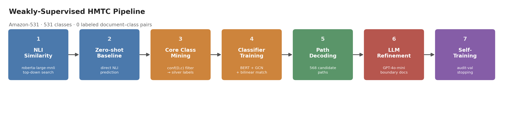
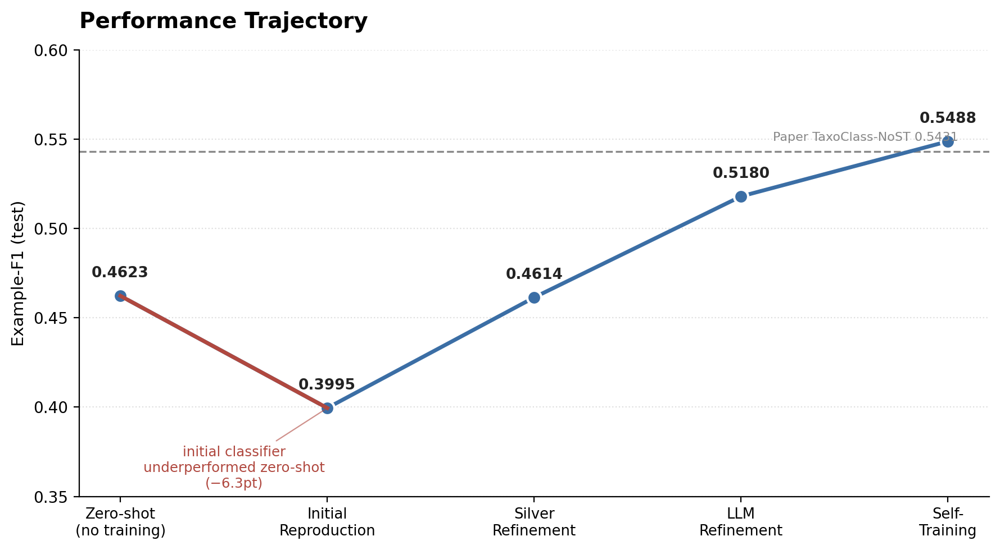

# Weakly-Supervised Hierarchical Multi-Label Text Classification

> Weakly-supervised 분류기가 자신의 zero-shot baseline보다 낮은 성능을 낸 이유를 데이터 중심으로 진단하고 해결한, TaxoClass(NAACL 2021) 재현 프로젝트.


<p align="center">
  
</p>

<p align="center">
  
</p>

## TL;DR

- TaxoClass(NAACL 2021)를 **Amazon-531**에 완전한 weakly-supervised 세팅으로 재현했습니다.
- 학습을 마친 분류기가 학습을 전혀 하지 않은 zero-shot baseline보다 낮은 성능을 내는 역전 현상을 발견하고 원인을 분석했습니다.
- 병목은 모델 구조가 아니라 **silver label 품질**이었습니다 — 겉보기 지표는 71%로 양호했지만, 실제 라벨 단위 정밀도는 **30%**였습니다.
- 데이터 정제 + LLM 기반 재라벨링으로 정밀도를 **30% → 49%**까지 끌어올렸고, Example-F1을 **0.40 → 0.55**로 개선했습니다.

상세 구현/실험/한계는 [Technical Report](docs/technical_report.md)에 정리했습니다.

---

## 📑 발표자료

본 저장소에는 프로젝트 내용을 보완한 **최신 발표자료(PPT)** 를 포함했습니다.

- 📊 [최신 발표자료 (PPTX)](./Weakly-Supervised-HTMC_Final_Presentation.pptx.pptx)
  
## Why This Project?

Weakly-supervised hierarchical text classification은 문서–라벨 쌍이 전혀 없다고 가정합니다. TaxoClass는 이 조건에서 taxonomy 정보만으로 pseudo label을 생성해 분류기를 학습시키는 프레임워크입니다.

재현 과정에서, 학습시킨 분류기가 오히려 아무것도 학습하지 않은 zero-shot 모델보다 낮은 성능을 냈습니다. 이 프로젝트는 모델 구조를 바꾸는 대신, **왜 성능이 떨어졌는지를 체계적으로 진단하고 병목을 규명하는 데** 집중했습니다. 결과는 위 그래프의 굴곡이 보여줍니다 — 병목은 데이터였고, 데이터를 개선하는 것만으로 zero-shot을 상회할 수 있었습니다.

## Key Results

<summary>단계별 Example-F1 (test) </summary>

| Stage | Example-F1 |
|---|---|
| Zero-shot (학습 없음) | 0.4623 |
| Initial Reproduction | 0.3995 |
| Silver Refinement | 0.4614 |
| LLM Refinement | 0.5180 |
| Self-Training | **0.5488** |

Self-Training 단계는 audit-validation stopping에 소량의 train gold label을 사용하므로 순수 weak-supervision 세팅을 벗어납니다. 논문 세팅을 그대로 준수한 최고 성능은 LLM Refinement 단계의 **0.5180**입니다. 전체 7단계 결과표는 Technical Report에 있습니다.


## What I Learned

처음에는 모델 구조가 병목이라고 생각했습니다. 하지만 학습 설정을 하나씩 통제하며 배제해 나간 끝에, 진짜 문제는 **데이터 품질을 측정하는 지표 자체**에 있었습니다. 언뜻 양호해 보이던 지표가 실제 문제를 가리고 있었습니다.

이 경험으로 배운 것은 두 가지입니다. 지표를 잘못 고르면 문제가 있어도 안 보인다는 것, 그리고 이 프로젝트에서는 모델을 바꾸는 것보다 데이터 품질을 개선하는 것이 훨씬 큰 폭의 성능 향상을 만들었다는 것입니다.

## Technical Highlights

**Finding 1 — 병목은 분류기가 아니었다.**
문서 단위 hit-rate는 양호해 보였지만, 실제 문제를 가리고 있었습니다. 지표를 라벨 단위 정밀도로 바꾸는 순간 병목이 드러났습니다.

**Finding 2 — 정밀도와 커버리지는 함께 움직이지 않는다.**
둘은 trade-off 관계입니다. 균형점을 실험으로 찾고, 문서 truncation 설정 오류를 함께 수정해 zero-shot 수준을 회복했습니다.

**Finding 3 — 모델을 바꾸지 않아도 성능은 오른다.**
아키텍처는 그대로 두고 silver label 품질만 올렸는데도 zero-shot을 상회했습니다. silver 정밀도와 최종 F1은 거의 1:1로 동행했습니다.

**Finding 4 — 예산은 전체가 아니라 경계에 써야 한다.**
전체 문서가 아니라 **결정 경계에 걸린 문서에만** LLM API 예산을 집중했습니다. 소규모 예산은 커버리지가 부족해 효과가 없었고, 예산을 10배로 늘리자 정밀도와 F1이 함께 뛰었습니다.

## Repository Structure

```
weakly-supervised-hmtc/
├── README.md
├── docs/               # Technical Report
├── figures/            # pipeline.png, performance_trajectory.png
├── scripts/            # 00~07 실행 스크립트 (번호 = 실행 순서)
├── src/                # 공용 모듈
├── results/            # 실험 결과 JSON
└── reference_data/     # Amazon-531 (TELEClass 공개 데이터)
```

각 스크립트의 역할은 [Technical Report](docs/technical_report.md#7-repository-structure)에 정리했습니다.

## Quick Start

```bash
# Phase 0: 데이터 구조 검증
python scripts/00_verify_dataset.py --data_dir reference_data/Amazon-531

# zero-shot baseline
python scripts/02_zeroshot_baseline.py --data_dir reference_data/Amazon-531

# 디코딩 + 평가 — cache/의 점수 행렬만으로 GPU 없이 실행 가능
python scripts/05_decode_eval.py --data_dir reference_data/Amazon-531
```

전체 파이프라인 실행 순서와 옵션은 Technical Report의 [Reproduction](docs/technical_report.md#8-reproduction) 섹션을 참고하세요.

## Citation

- Shen et al., [TaxoClass: Hierarchical Multi-Label Text Classification Using Only Class Names](https://aclanthology.org/2021.naacl-main.335/), NAACL 2021.
- Zhang et al., [TELEClass: Taxonomy Enrichment and LLM-Enhanced Hierarchical Text Classification with Minimal Supervision](https://doi.org/10.1145/3696410.3714940), WWW 2025 — Amazon-531 reference data 출처.

---

**[→ Technical Report 전체 보기](docs/technical_report.md)** — 문제 정의, 파이프라인 세부 구현, 전체 7단계 결과표, 발견/수정한 구현 버그 3건, 정량 분석, 한계.
