# Figures — 프로젝트 시각 자료

이 폴더는 프로젝트를 설명하는 데 핵심이 되는 시각 자료 **17종**을 담고 있습니다.
발표(PPT)와 문서에 **그대로 사용할 수 있는 품질**로 제작했으며, 모든 수치는
레포의 실제 산출물(`results/*.json`, `logs/*.log`, `README.md`)에서 계산했습니다 — 지어낸 값은 없습니다.

- **PNG** (`png/`) — 고해상도 2× 래스터. 슬라이드·문서 삽입용.
- **SVG** (`svg/`) — 벡터. Pretendard 서브셋을 자체 임베드해 어디서 열어도 서체가 유지됩니다.
- **재현** (`src/`) — `data.py`(출처 주석 포함) → `svgkit.py`(SVG 프레임워크) → `figures.py`(각 Figure) → `render_fig.mjs`(PNG 렌더). 실행: `python3 figures.py && node render_fig.mjs`.

**디자인 규칙** (PPT와 동일 계열): 밝은 배경 · **오렌지 = precision / 최종 채택** · 회색 = 중간 단계 · 진회색 = 하락 지점 · 네이비 = 참조/기준선 · 서체 Pretendard.

### 발표 흐름별 매핑

| 발표에서 설명할 것 | 사용할 Figure |
|---|---|
| Pipeline | `01` |
| Data flow / preprocessing | `02` `03` |
| Model architecture | `04` `05` `06` |
| Experiment design | `03` `11` |
| Feature engineering | `04` `10` `17` |
| 성능 개선 과정 | `12` `13` |
| 결과 비교 | `16` |
| Error analysis | `07` `08` `09` |
| Ablation study | `13` `14` `15` |

---

## 1. 파이프라인 · 데이터 · 모델

### 01 · 전체 파이프라인
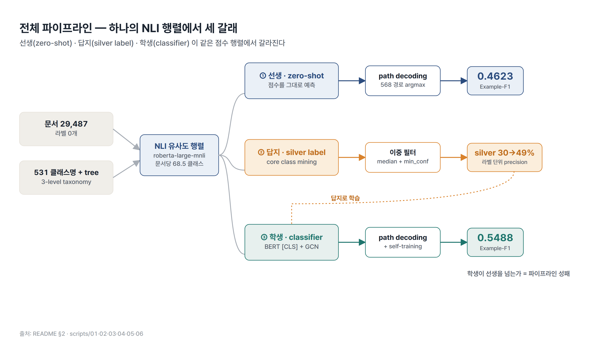
하나의 NLI 점수 행렬에서 **선생(zero-shot) · 답지(silver label) · 학생(classifier)** 세 갈래가 갈라진다. 학생이 선생을 넘는지가 파이프라인 전체의 성패 지표. · *README §2*

### 02 · 문제 설정 · Taxonomy 구조
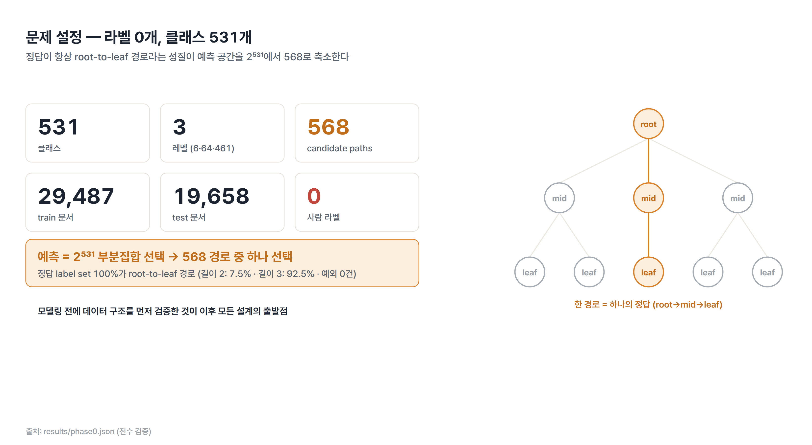
라벨 0개, 클래스 531개(6·64·461). 정답이 항상 root-to-leaf 경로라는 성질이 예측 공간을 **2⁵³¹ → 568 경로**로 축소한다. · *results/phase0.json (전수 검증)*

### 03 · 평가 프로토콜 (GT 역할 분리)
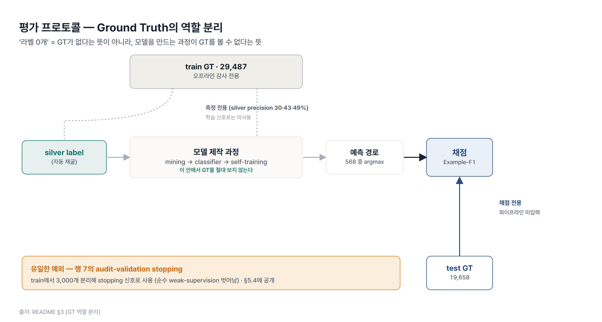
‘라벨 0개’ = GT가 없다는 뜻이 아니라 **모델 제작 과정이 GT를 볼 수 없다**는 뜻. test GT는 채점 전용, train GT는 오프라인 감사 전용. · *README §3*

### 04 · Core Class Mining 메커니즘
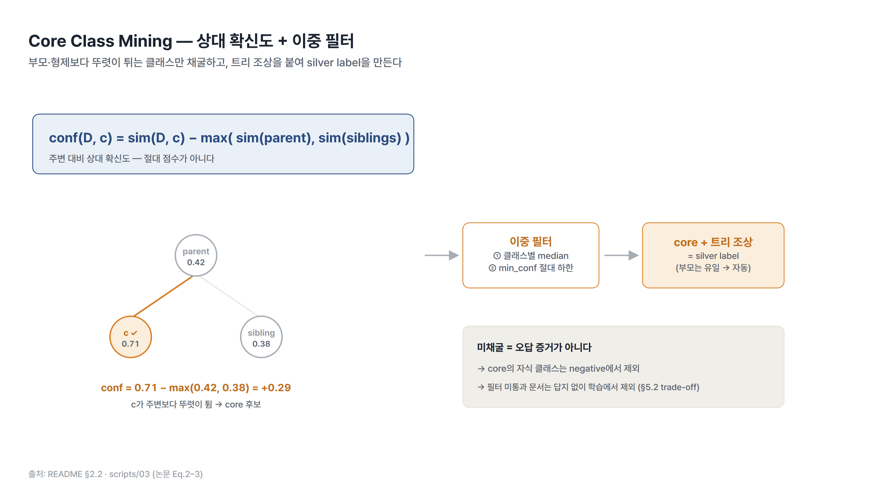
`conf(D,c) = sim(D,c) − max(sim(parent), sim(siblings))` — 절대 점수가 아닌 **상대 확신도** + 이중 필터(median·min_conf) → silver label. · *README §2.2 (Eq.2–3)*

### 05 · 분류기 구조 (BERT + GCN + bilinear)
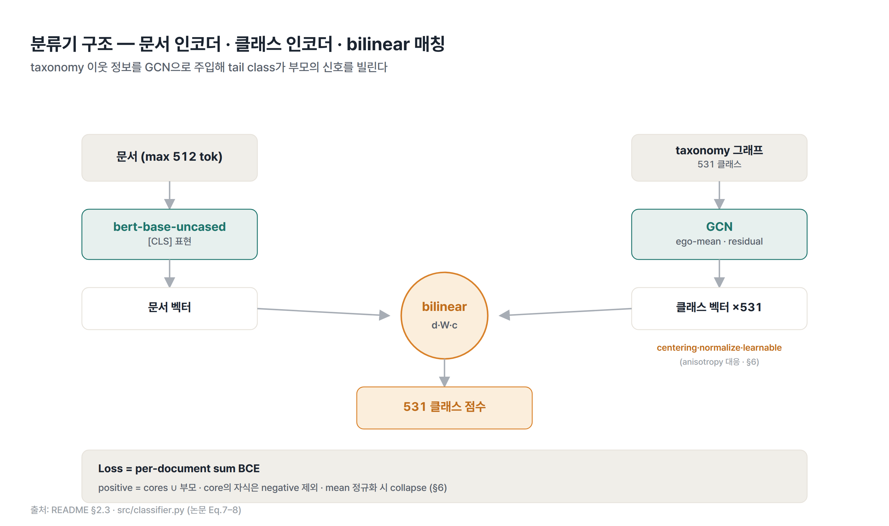
문서 인코더(BERT [CLS]) · 클래스 인코더(GCN, taxonomy) · bilinear 매칭 → 531 점수. loss는 per-document **sum** BCE. · *README §2.3 (Eq.7–8)*

### 06 · Path Decoding
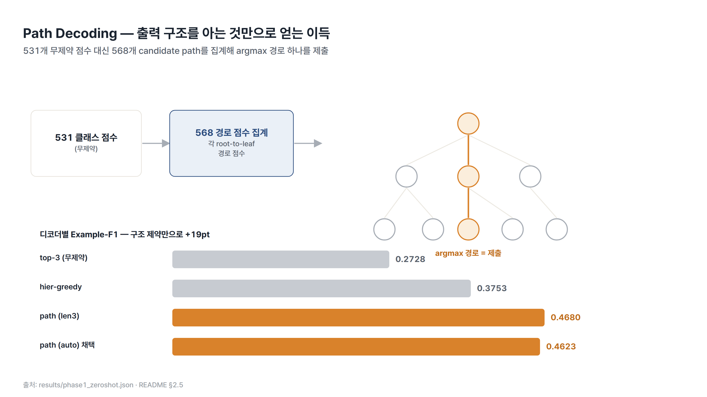
531개 무제약 점수 대신 568개 candidate path를 집계해 argmax 경로 하나를 제출. 출력 구조를 아는 것만으로 **top-3 대비 +19pt**. · *results/phase1_zeroshot.json · README §2.5*

---

## 2. 진단 · 오류 분석 · Feature Engineering

### 07 · 지표 반전 (지표가 데이터 문제를 가림)
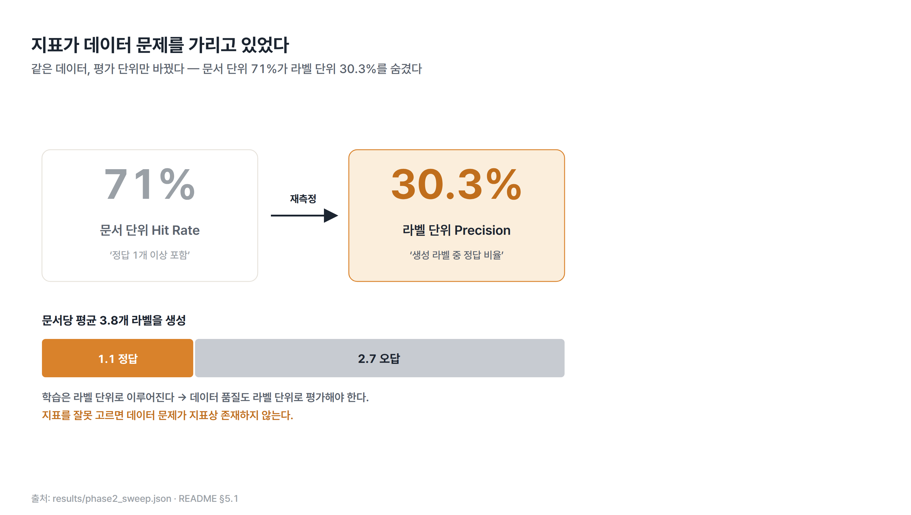
평가 단위만 바꿨다 — 문서 단위 **71%** 가 라벨 단위 **30.3%** 를 숨겼다. 문서당 평균 3.8개 라벨 중 2.7개가 오답. · *results/phase2_sweep.json · README §5.1*

### 08 · 과적합 시그니처
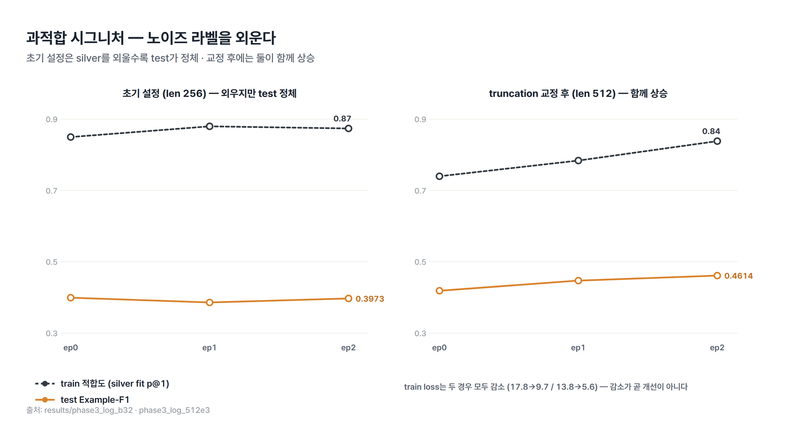
초기 설정은 silver를 외울수록(train fit↑) test가 정체. truncation 교정(512) 후 둘이 함께 상승. **train loss 감소가 곧 개선이 아니다.** · *results/phase3_log_b32 · phase3_log_512e3*

### 09 · 레벨별 정확도 (오류의 집중)
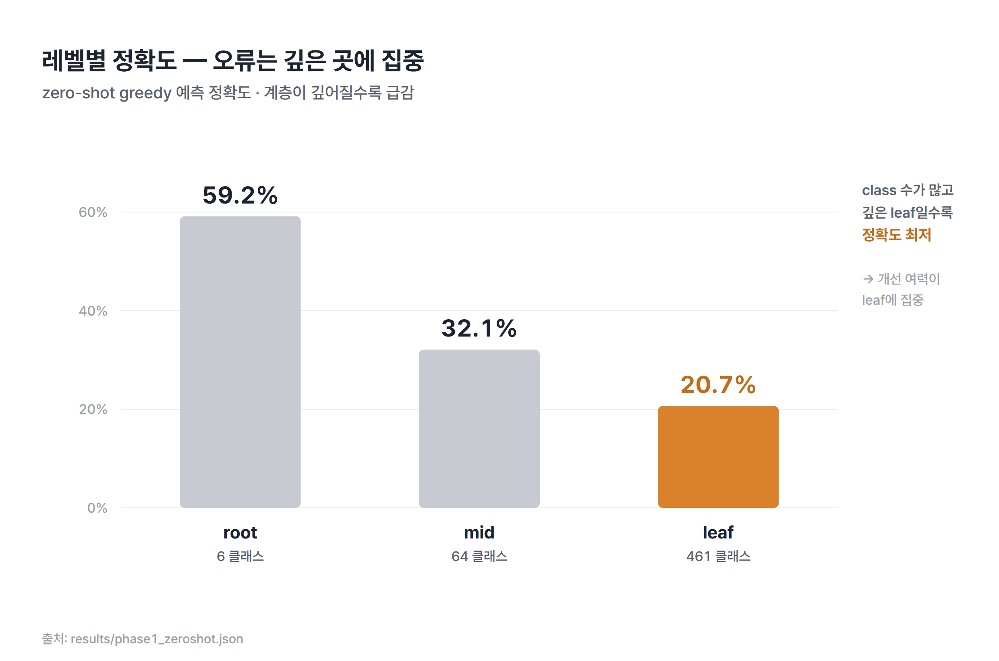
zero-shot greedy 정확도: root 59.2% → mid 32.1% → leaf 20.7%. 계층이 깊어질수록 급감 — **개선 여력은 leaf에 집중**. · *results/phase1_zeroshot.json*

### 10 · Precision–Coverage 트레이드오프
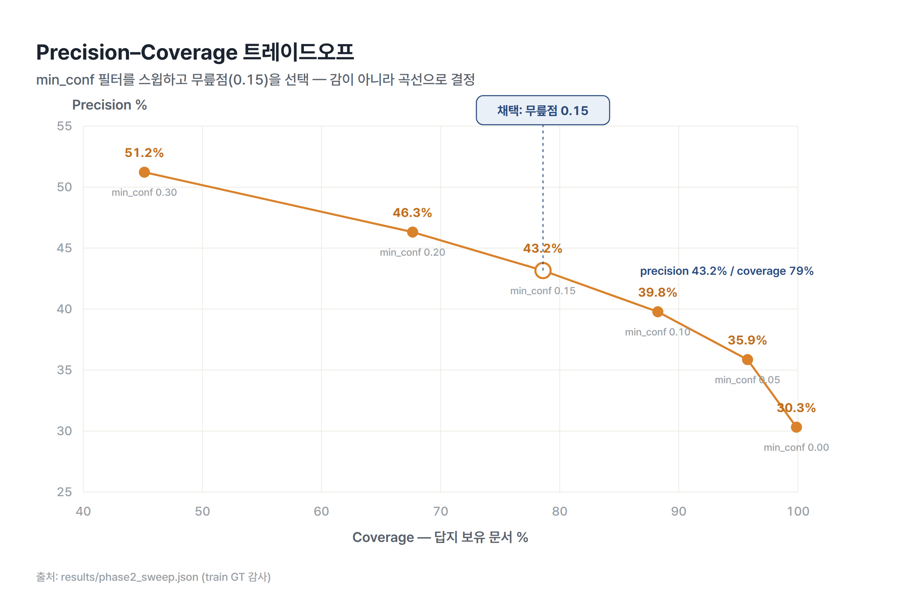
min_conf 필터를 스윕하고 **무릎점(0.15)** 을 선택. 임의 선택이 아니라 곡선 위의 의사결정. · *results/phase2_sweep.json*

---

## 3. 실험 설계 · 성능 개선

### 11 · 가설 배제 로그
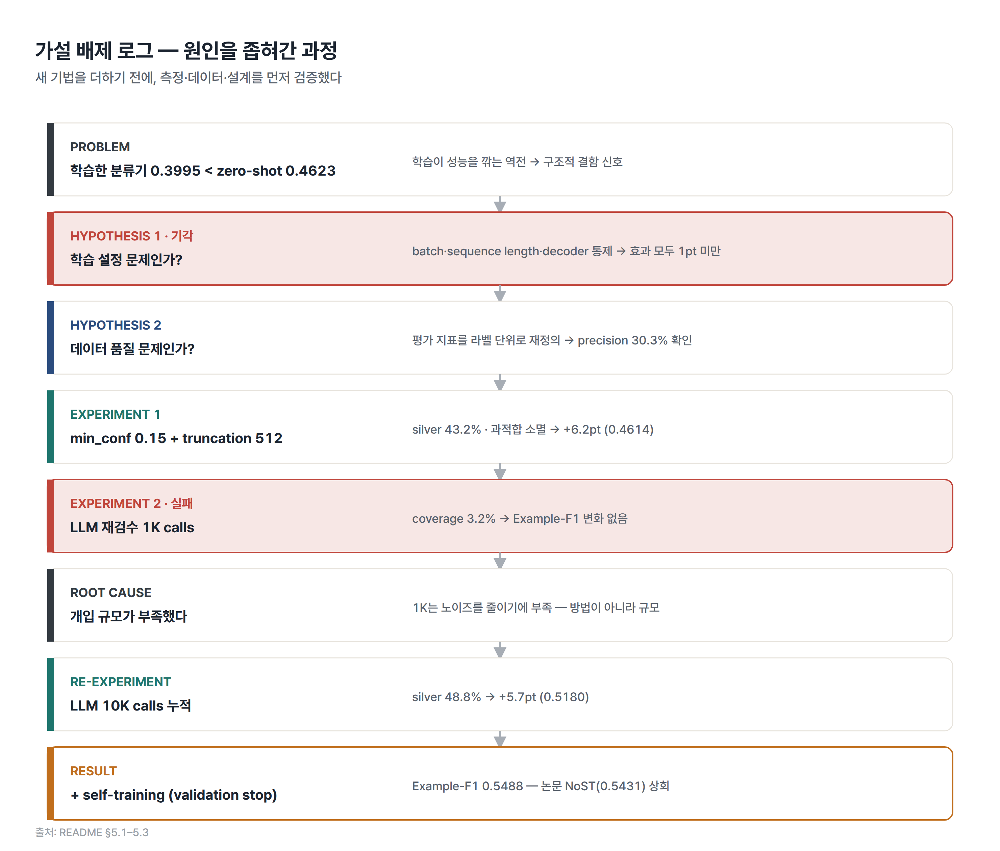
PROBLEM → 기각 → 원인 → 재실험 → RESULT. 새 기법을 더하기 전에 측정·데이터·설계를 먼저 검증한 과정. 좌측 라벨만 읽어도 서사가 성립. · *README §5.1–5.3*

### 12 · 성능 궤적
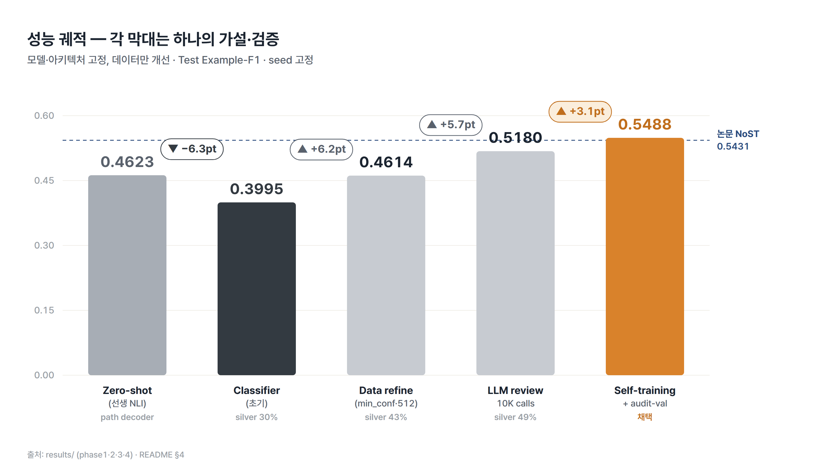
각 막대는 하나의 가설·검증. 모델·아키텍처 고정, **데이터만 개선**으로 0.3995 → 0.5488 (논문 NoST 0.5431 상회). · *README §4*

### 13 · Precision–F1 동행
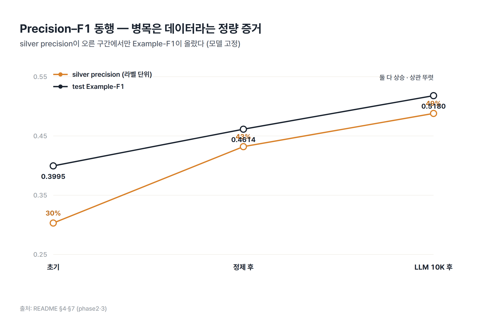
silver precision(30→43→49%)이 오른 구간에서만 Example-F1(0.40→0.46→0.52)이 올랐다 — **‘병목은 데이터’의 정량 증거**. · *README §4·§7*

---

## 4. Ablation · 결과 비교

### 14 · LLM 예산의 임계 규모
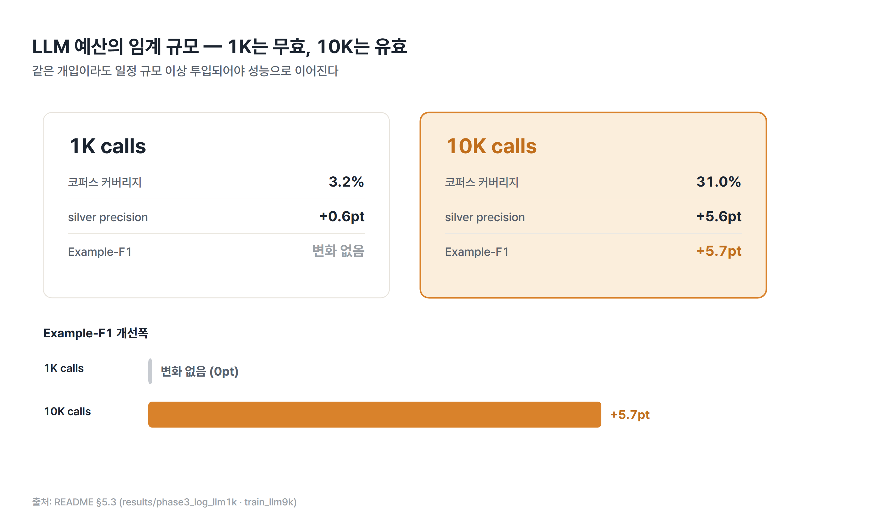
같은 개입이라도 **1K는 무효(0pt), 10K는 유효(+5.7pt)**. 개입-규모 곡선을 얻어야 예산 의사결정이 가능하다. · *README §5.3*

### 15 · Self-training Stopping
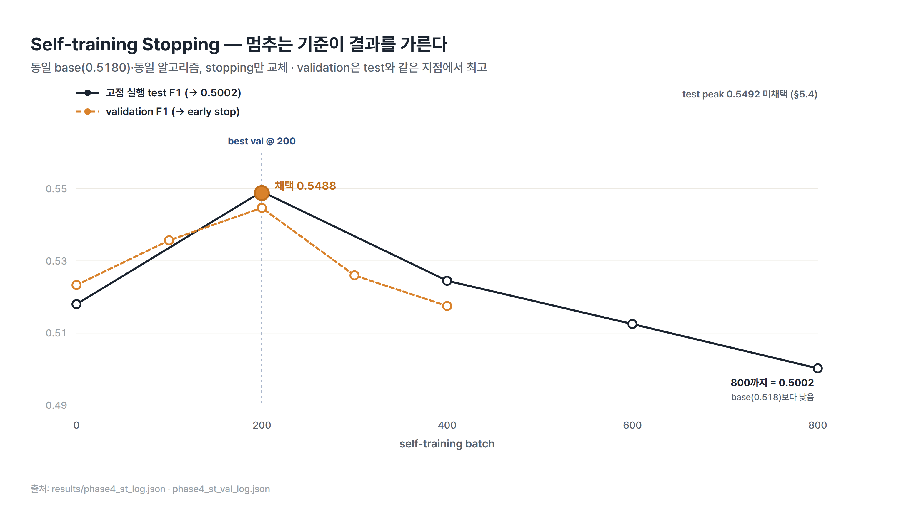
동일 base·동일 알고리즘, stopping만 교체. validation이 test와 같은 지점(batch 200)에서 최고 → early stop이 0.5488 확보. 800까지 가면 0.5002로 하락. · *results/phase4_st_log · phase4_st_val_log*

### 16 · 누적 개선표 (논문 대비)
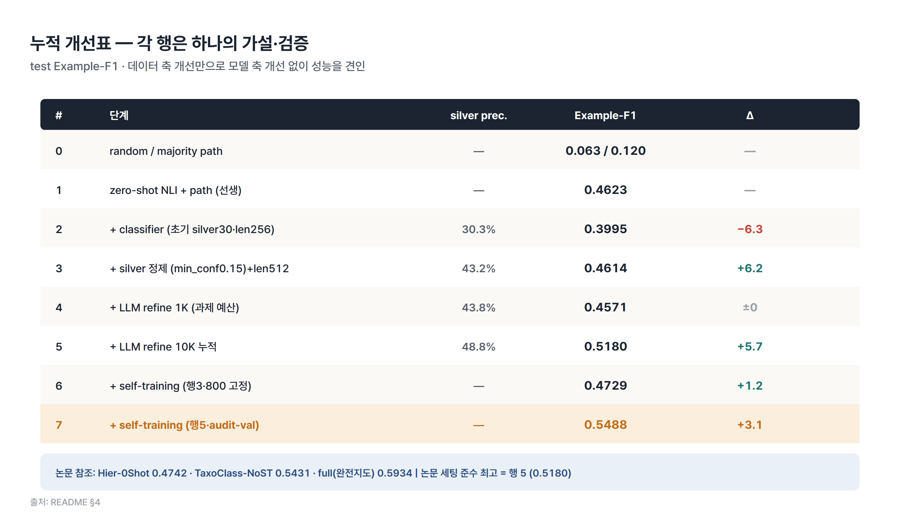
zero-shot → 최종까지 7행 가설·검증 누적표. 논문 참조치(Hier-0Shot 0.4742 · NoST 0.5431 · full 0.5934) 병기. · *README §4*

---

## 5. 재현 노트

### 17 · 논문–구현 이슈
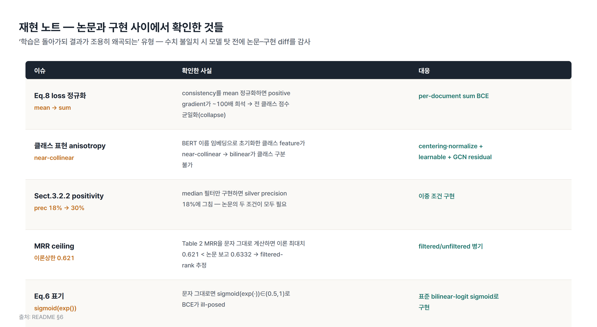
loss 정규화 collapse, 클래스 anisotropy, positivity 조건 등 **‘학습은 돌아가되 결과가 조용히 왜곡되는’** 5가지 이슈와 대응. · *README §6*
