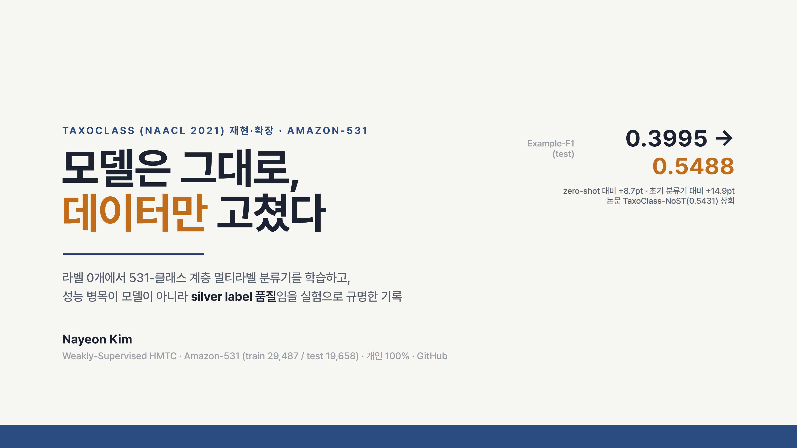
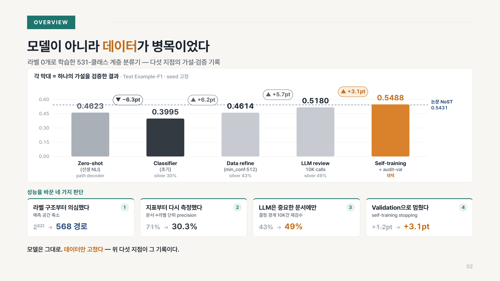
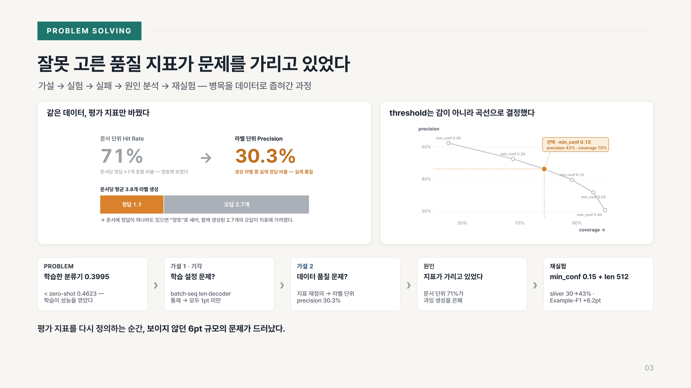
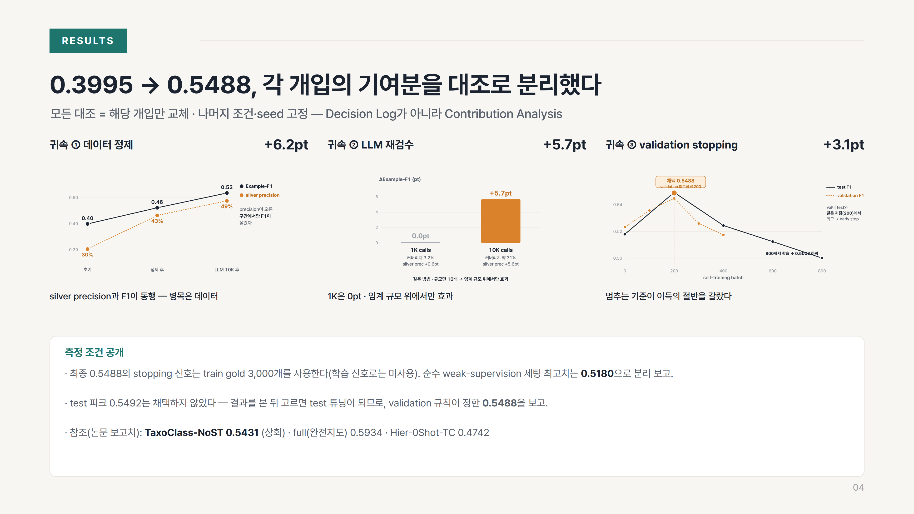

# Portfolio — Weakly-Supervised HMTC (TaxoClass 재현·확장)

이 폴더는 본 레포지토리의 프로젝트를 채용 담당자에게 전달하기 위한 **포트폴리오 슬라이드**와,
슬라이드에 쓰인 **figure**, 그리고 이를 다시 만들 수 있는 **생성 스크립트**를 담고 있다.

> 한 줄 요약: 라벨 0개에서 531-클래스 계층 분류기를 학습하고, 성능 병목이 모델이 아니라
> silver label 품질임을 실험으로 규명한 과정. Example-F1 **0.3995 → 0.5488** (논문 NoST 0.5431 상회).

## 슬라이드 미리보기

**1. 표지**


**2. Overview — 성능 궤적과 네 가지 판단**


**3. Problem Solving — 지표 반전 · threshold 곡선 · 의사결정 로그**


**4. Results — 기여 분석과 측정 조건 공개**


> 편집 가능한 원본은 [`portfolio.pptx`](portfolio.pptx), 열람용은 [`portfolio_preview.pdf`](portfolio_preview.pdf).

## 파일

| 파일 | 설명 |
|---|---|
| `portfolio.pptx` | **편집 가능한 발표 자료 (4장)**. 텍스트·제목·카드·표는 네이티브 요소로 직접 수정 가능하고, 차트는 `figures/`의 이미지로 삽입되어 있다. 슬라이드마다 발표용 노트(speaker notes) 포함. |
| `portfolio_preview.pdf` | 4장의 **시각 미리보기**(바로 열람/제출용). PPTX가 의도대로 보이는 기준 화면. |
| `slides/01–04.png` | 각 슬라이드 전체 이미지 (1920×1080). |
| `figures/*.png` | 슬라이드에 쓰인 **개별 차트 6종** (투명 배경, 재사용용). |
| `src/*` | figure·슬라이드·PPTX **생성 스크립트** (아래 재현 방법 참고). |

## 슬라이드 구성

1. **표지** — 프로젝트 한 줄 서사 + 핵심 성능(0.3995 → 0.5488).
2. **Overview** — 성능 궤적 워터폴(zero-shot → 초기 분류기 → 데이터 정제 → LLM 10K → self-training)과 성능을 바꾼 네 가지 판단.
3. **Problem Solving** — 잘못된 품질 지표(문서 71% vs 라벨 30.3%), precision–coverage 곡선의 무릎점 선택, 가설→기각→원인→재실험 의사결정 로그.
4. **Results (Contribution Analysis)** — 각 개입의 기여분을 대조 실험으로 분리(귀속 ①②③)하고, 측정 조건을 공개.

## 데이터 출처 (중요)

슬라이드의 **모든 수치는 이 레포의 실제 실험 결과에서 계산**했다. 지어낸 값은 없다.
`src/data.py`에 각 수치의 출처(파일)가 주석으로 기록되어 있다.

- 성능 궤적·기여분: `README.md` §4 누적 개선표, `results/phase1_zeroshot.json`, `results/phase3_log*.json`
- precision–coverage 곡선: `results/phase2_sweep.json` (min_conf 0.0–0.3 스윕)
- 지표 반전(71%→30.3%, 문서당 3.8개 중 2.7개 오답): `results/phase2_sweep.json`(min_conf 0), `README.md` §3·§5.1
- self-training stopping 궤적: `results/phase4_st_log.json`(고정 800배치), `results/phase4_st_val_log.json`(audit-validation), `st_val.log`

## 편집 방법

- `portfolio.pptx`를 PowerPoint / Keynote / Google Slides에서 열어 텍스트를 직접 수정.
- **서체**: 슬라이드는 [Pretendard](https://github.com/orioncactus/pretendard)(무료, OFL)로 디자인했다.
  정확한 서체로 보려면 Pretendard를 설치할 것. (미설치 시 본문 텍스트만 기본 서체로 대체되며, 차트 이미지는 항상 정상 표시된다.)
- 차트 문구·수치를 바꾸려면 `src/`의 스크립트를 수정 후 아래 절차로 다시 생성.

## Figure 재현 방법

```bash
cd portfolio/src
pip install pymupdf pillow          # 렌더 유틸
npm install playwright pptxgenjs sharp

# 1) 개별 차트(figures/) 생성
python charts.py && node render_charts.mjs

# 2) 슬라이드 미리보기(PNG) 생성
python gen12.py && python gen34.py && node render.mjs

# 3) 편집용 PPTX 생성
node build_pptx.mjs                 # -> portfolio.pptx
```

> 렌더링은 Chromium(Playwright)으로 하며, 한글은 Pretendard 설치를 전제로 한다.

## 설계 노트

- 색 규칙: **주황 = precision / 최종 채택**, 회색 = 데이터 개선 단계, 진회색 = 성능 하락(−6.3pt) 지점, 티일 = 섹션/강조.
- 차트는 **단일 축 원칙**을 지켰다. 이중축(두 개의 y-scale)은 왜곡 위험이 있어, precision과 F1의 동행은
  두 지표가 모두 [0,1] 분수임을 이용해 하나의 공유 축에 그렸다.
- self-training stopping 도표는 **동일 base(row 5)·동일 알고리즘**에서 stopping만 바꾼 대조로 그렸다:
  고정 800배치는 0.5002로 하락, validation 기반 조기 종료는 test와 같은 batch 200에서 0.5488을 확보.
